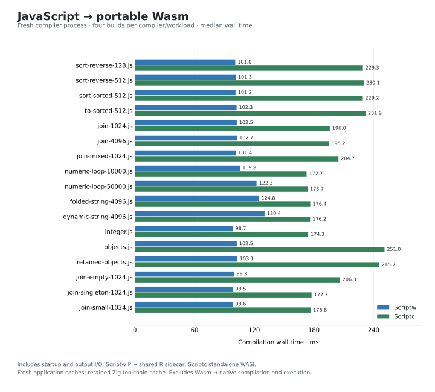
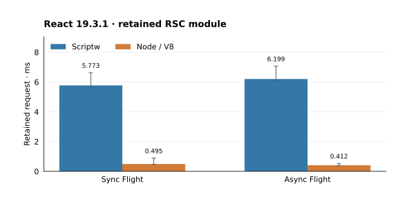

# scriptw

Scriptw is an experimental JavaScript-to-WebAssembly compiler written in Rust.
The goal is ECMAScript correctness with competitive compilation and execution.
Programs and builtins compile to real Wasm; WebAssembly is the sole output target.

## Try it

Requires Rust 1.94 or newer and the repository's experimental Wasmtime 47 backend.

```sh
cargo build --locked --release -p scriptw-cli --bin scriptw
printf 'print("Hello Wasm");\n' > hello.js
./target/release/scriptw run hello.js
SCRIPTW_WASM_DUMP=hello.wasm ./target/release/scriptw build wasm hello.js
```

Rust applications can [embed Scriptw](docs/rust-rewrite/contracts/foreign-modules.md)
in their own Wasmtime Engine, Store and Linker, with synchronous and async host functions.
Top-level embedded calls use a guarded stack on the caller’s thread.
Module `for-in` and `for-of` loops work across top-level `await`.

## Benchmarks

Latest published measurements follow. Each cohort identifies its recorded build;
these figures do not requalify every workload on current HEAD.

<!-- runtime-comparison:start -->
**Runtime kernels · 2026-11-02**, compiler `87385fff34d1`; Node **24.12.0**, V8 **13.6.233.17-node.37**.
Scriptw is faster than Scriptc in **17/17 workloads** in both blocks; block execution geometric means are **0.455–0.458× Scriptc**.
Scriptw is faster than V8 in **6/17 workloads** in both blocks; block execution geometric means are **1.098–1.106× V8**.
Wasm is compiled before timing; Scriptw entry includes Realm bootstrap. V8 creates a fresh context before timing; entry checks outputs.
See [measurement details and charts](docs/rust-rewrite/benchmarks.md#runtime-comparison), [data and identities](docs/rust-rewrite/execution-current.json), and [workflow](CONTRIBUTING.md#benchmark-charts).
<!-- runtime-comparison:end -->

**JavaScript → portable Wasm · 2026-11-02:** Scriptw is faster than Scriptc in
**17/17 workloads**, taking **0.524× Scriptc time** by geometric mean.
Includes CLI startup and output I/O; native compilation and execution are separate.
[Data](docs/rust-rewrite/compilation-current.json).



<!-- application-benchmarks:start -->
**Edge kernels · 2026-11-02**, compiler `87385fff34d1`:
Scriptw takes **3.8–9.3× Scriptc time** across 5 completed comparisons.
These use plain request/response records; networking and Web APIs are outside the workload.
[Application charts and failed attempts](docs/rust-rewrite/benchmarks.md#application-workloads) ·
[Data](docs/rust-rewrite/applications-current.json).
<!-- application-benchmarks:end -->

**React 19.3.1 RSC · 2026-11-08**, source `0c2c10dac9c0`; exact Flight output.

| Retained request | Scriptw Fast | Scriptw Speed | Node 24 / V8 |
| --- | ---: | ---: | ---: |
| Sync | 4.663 ms | 3.695 ms | 0.490 ms |
| Async | 5.068 ms | 4.033 ms | 0.400 ms |



Eight fresh processes per policy in two balanced blocks; 3 warmups and 7 timed requests per mode. Full Flight serialization and consumption are timed; setup precedes the window, and JSON encoding and final output validation follow it. Fast and Speed are separately scored native policies; their optimization and register-allocation settings differ together. The async catalog adds a resolved Promise and markup and performs no I/O. [Phases, workload bounds and limits](docs/rust-rewrite/benchmarks.md#react-server-components) · [RSC identities](docs/rust-rewrite/rsc-current.json).

**Focused performance situations · 2026-11-08**, source `0c2c10dac9c0`: 21 standalone programs compare Fast, Speed and V8.
[Scores and workload bounds](docs/rust-rewrite/benchmarks.md#focused-performance-situations) · [Situation data](docs/rust-rewrite/situations-current.json) · [RSC data](docs/rust-rewrite/rsc-current.json).

## Current Status
<!-- scriptw-status:start -->
Published Test262 (`wasm-aot`, `2026-10-23`): `102990/102994` passed; `4` failed.
Native-host conformance includes cases unsupported by standalone Wasm; it does not establish current HEAD coverage.
Pinned revisions: `ecma262=5345883164f463e87f8b40aca4956157ecba8783` `test262=6a4268a9354a545d41c3b62efebc478ed8c521f4`
Compiler build fingerprint: `7337ccbc2834d0d17902382431789227b6dddf8fda40842bf19c4243161d56f9`; executing image SHA-256: `32ee09a9a33daaf7d27fcb1b649db7223fcbd3ce00f0943cf19cce5ef886101b`
Published status artifacts: `/workspace/scriptw-full-suite-20261022/test262/snapshots/scriptw-hot-reads-b9ecfe64b-20261022-aggregate-13327628081868727304.json` and `/workspace/scriptw-full-suite-20261022/test262/snapshots/scriptw-hot-reads-b9ecfe64b-20261022-aggregate-13327628081868727304.txt`
[Full test details](docs/rust-rewrite/test262-current.md) · [Refresh workflow](CONTRIBUTING.md#test262).
<!-- scriptw-status:end -->

<!-- scriptw-test-graph:start -->


**Published full run, 2026-10-23:** 102,994 mode-specific
executions at pin `6a4268a93`, compiler `b9ecfe64b`.
The **429 out-of-scope executions** passed through the native host;
standalone Wasm excludes their dynamic source compilation. All four categories
retain the full denominator, including every failure.
[Scope inventory](docs/rust-rewrite/test262-chart-full-20261022.json) · [Published result](test262/snapshots/published-status-wasm-aot-857165c90f0fb4ac3ec0493a3b4470977007808c5b1c10ecf5512840edc80f46.json) ·
[Scope policy](docs/rust-rewrite/runtime-requirements.md#out-of-scope-tests).
<!-- scriptw-test-graph:end -->

Scoped verification (**2026-11-08**, source `0c2c10dac9c0`): 2,828 broad checks, 380 source guards, and 9 CLI smokes pass. Full CI, Test262, and private units were not rerun; existing formatting/Intl issues and four historical AOT unit failures remain [owned](docs/rust-rewrite/current-inventory.md).

## Caveats

- **Experimental backend:** Wasm GC, typed function references, exception handling
  and related features are required. Browser/other-engine integration is unverified.
  A bare WASI host does not provide Scriptw's runtime or host imports.
- **Incomplete conformance:** failures remain counted. The published run belongs
  to its recorded compiler; selected checks do not establish full ECMAScript coverage.
- **Dynamic source compilation:** standalone Wasm has no parser or general runtime
  `eval`/`new Function`. Supported prepared sources and native-host behavior have
  [separate limits](docs/rust-rewrite/runtime-requirements.md).
- **Bounded Web APIs:** UTF-8 codecs, byte streams with default readers, events,
  abort signals and tasks support the tested RSC fixtures. Fetch/Request/URL,
  DOM nodes and full WHATWG conformance remain unsupported or unverified.
- **Runtime ABI 53:** binding cells own mutable value fields; source functions
  support a typed wide local-argument entry alongside the narrow entry.
  Rebuild older Portable bundles and native images.

[Development and verification](CONTRIBUTING.md) ·
[Current work](docs/rust-rewrite/current-inventory.md) ·
[Compiler/runtime contracts](docs/rust-rewrite/contracts/README.md).
